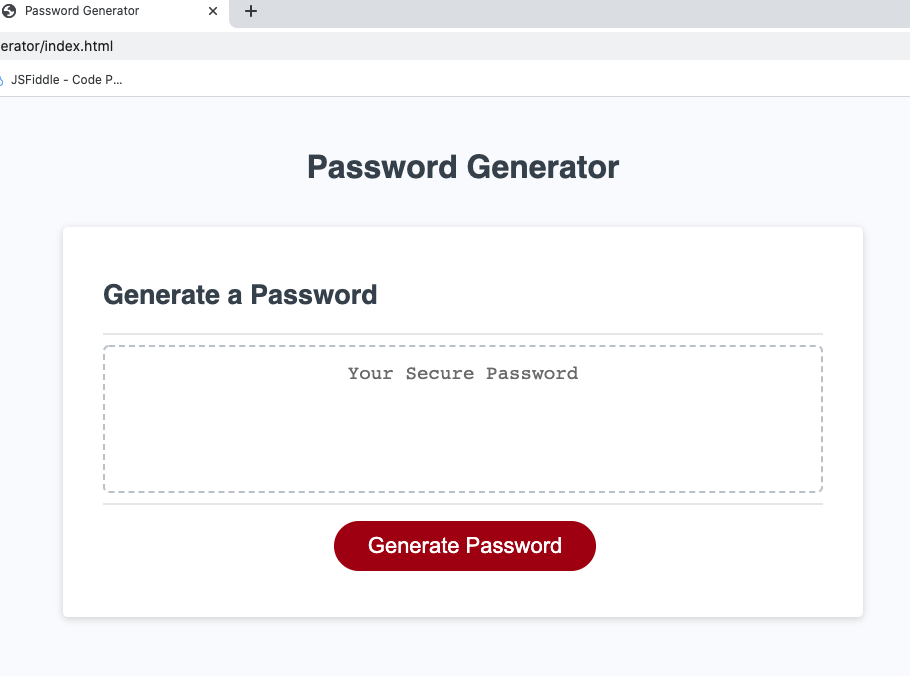
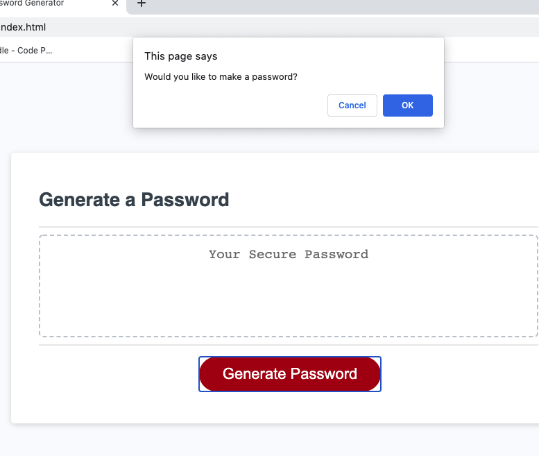
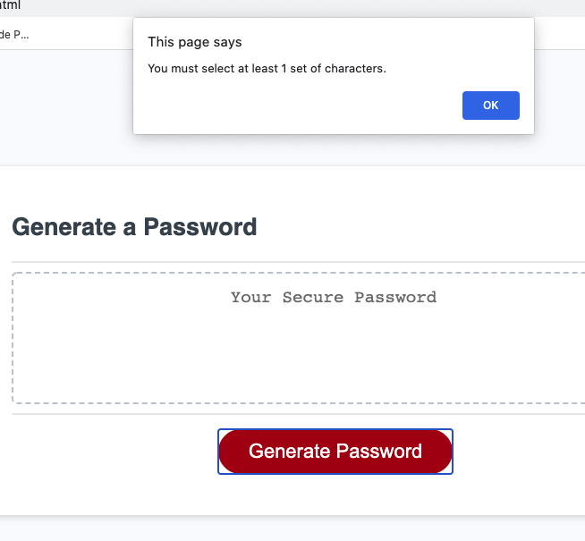
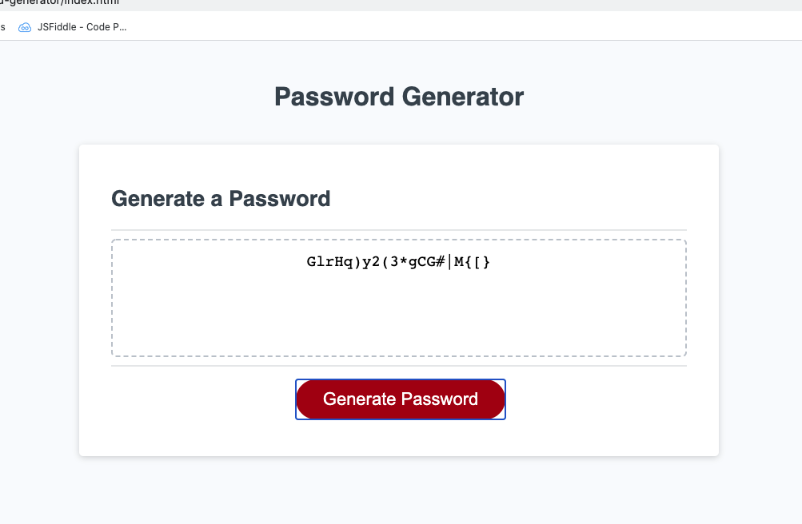

# Password-Generator

## Goal:
    The password generator needs to generate a password using parameters that the user selects.
        - Can include upper case, lower case, special characters, and numbers.
        - Must include at least one group.
    
    The web app must reject passwords without:
        - 8 to 128 characters
        - Or have an input lengtht that is not an integer

## Link
    https://daveyrojo.github.io/password-generator/

## Screen Shots
    Opening Page

    Initial Confirm

    No Characters Selected

    Generated Password
